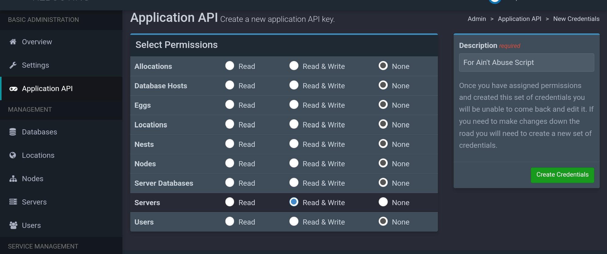
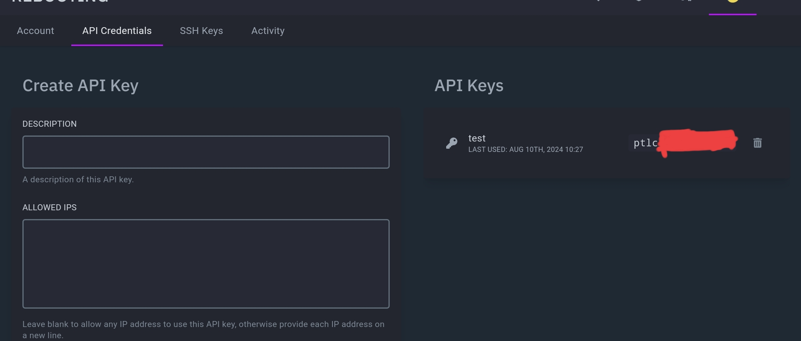

# Pterodactyl Moderation Script

This script automates the process of moderating servers on the Pterodactyl panel. It works well for managing Discord bots and supports the following script types: `['.js', '.py', '.ts', '.cs', '.rs', '.lua']`.

## Setup

1. Obtain your Pterodactyl application API key.
   
2. Obtain your Pterodactyl client API key.
   
3. Use your panel URL with `/api` appended at the end.
4. Get an API key for Groq (for the AI) from: https://console.groq.com/keys
5. Configure the allowed nests and eggs.
